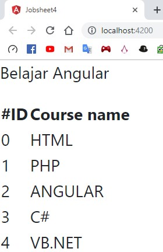
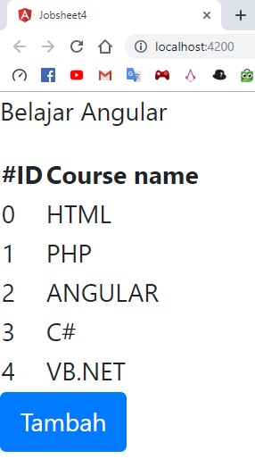

# JOBSHEET 4 WEB

  
**Praktikum - Bagian 1: Component Basic**

Menambahkan code pada courses.component.ts



```typescript
import { Component, OnInit } from '@angular/core';
import { CoursesService } from '../courses.service';

@Component({
  selector: 'app-courses',
  templateUrl: './courses.component.html',
  styleUrls: ['./courses.component.css']
})
export class CoursesComponent implements OnInit {

  title = 'Belajar Angular';
  Courses;
  binding = 'property-binding';
  imageUrl = 'http://lorempixel.com/400/200';

  constructor(private service:CoursesService) {
    this.Courses = service.getCourses();
   }

  ngOnInit() {
  }
}
```



Menambahkan code pada courses.component.html



```markup
<p>
  {{ title }}
</p>
<table>
  <thead>
    <th>
      #ID
    </th>
    <th>
      Course name
    </th>
  </thead>
  <tbody>
    <tr *ngFor="let Course of Courses">
      <td>{{ Course.id }}</td>
      <td>{{ Course.name }}</td>
    </tr>
  </tbody>
</table>

```



Soal-1 :



**Praktikum - Bagian 2: Attribute Binding**

Menambahkan `colSpan = 2;`Pada line 15 di courses.component.ts

Menambahkan code untuk membuat table pada courses.component.html



```markup
<table>
  <tr>
    <td [colspan] = 'colSpan'></td>
  </tr>
</table>
```



Error akan muncul seperti ini


Untuk memperbaiki tambah "attr." sebelum colspan



```markup
<table>
  <tr>
    <td [attr.colspan] = 'colSpan'></td>
  </tr>
</table>
```




Soal-2:


Soal-3:

Membuat button `<button class = "btn btn-primary" type = "button">Tambah</button>`



**Praktikum - Bagian 3: Class Binding**

Menambahkan  `isActive = true;`pada courses.component.ts di line 16

Menambahkan code dibawah tabel pertama :



```markup
<h2>property-binding</h2>
<h2>property-binding</h2>


```



Mengubah  `isActive = true;` menjadi  `isActive = false;`

**Praktikum - Bagian 4: Style Binding**

`<button class = "btn btn-primary" type="button" [style.backgroundColor] = "isActive?'blue' : 'white'">Tambah</button>`

Soal-4:


**Praktikum - Bagian 5: Event Binding**

Menambahkan code `onSave() { console.log("button sudah di klik") }`pada baris 18

Menambahkan code `<button type="button" class = "btn btn-default" (click) = "onSave()">Button</button>` pada baris 33


Menambahkan parameter `$event` pada method `onSave()`



```typescript
onSave($event) {
    console.log("button sudah di klik", $event)
  }
```



Menambah code pada button ke-3

`<button type="button" class = "btn btn-danger" (click) = "onSave($event)">Button</button>`

Soal-5:


Menambahkan method `onDivClick()` dibawah method `onSave()`



```typescript
onDivClick($event) {
    console.log("ini method div", $event)
  }
```



Membuat button dengan div



```markup
<div (click) = "onDivClick($event)">
  <button type="button" class="btn btn-danger" (click) = "onSave($event)">button</button>
</div>
```



Soal-6:


**Penjelasan**: Console.log muncul 2 pesan ya itu mengenali method onDivClick\(\) dan onSave\(\) jadi kedua method akan terpanggil dalam ketukan pada button

Menambahkan `$event.stopPropagation();` pada method onSave\(\) untuk mengatasi masalah diatas

Soal-7:


**Penjelasan:** Kegunaan dari stopPropagation\(\) adalah untuk mengatasi terjadinya pengenalan pada event method selanjutnya \(hanya pada parent method\)


**Praktikum - Bagian 6: Event Binding**

Membuat input berupa keyup `<input type = "text" (keyup.enter) = "onekeyUp()">`

Membuat method onekeyUp\(\)



```typescript
  onkeyUp() {
    console.log("enter was pressed");
  }
```



Soal-8 dan Soal-9:


**Praktikum - Bagian 7: Template Binding**

Tambahkan `#nama` pada input `<input type = "text" #nama (keyup.enter) = "onkeyUp()(nama.value)">`

Memberi parameter pada method onkeyUp\(\)



```typescript
  onkeyUp(nama) {
    console.log(nama);
  }
```



Soal-10


**Penjelasan:** Jika kolom input diisi dengan text, lalu tekan enter, maka isi dari kolom tersebut akan muncul di consol.

**Praktikum - Bagian 8: Two Way Binding**

Membuat attribute baru `nama = 'Alan';` dan ubah parameter pada method onkeyUp\(\)



```typescript
onkeyUp() {
    console.log(this.nama);
  }
```



Ubah tag input menjadi `<input type="text" [value] = 'nama' (keyup.enter) = "nama = $event.target.value;onkeyUp()">`

Soal-11:


**Penjelasan:** Isi dari atrribute nama akan di tampilkan pada kolom input dengan `$event.target.value`. 

Meng-edit file app.module.ts mendjadi seperti berikut



```typescript
import { BrowserModule } from '@angular/platform-browser';
import { NgModule } from '@angular/core';
import { FormsModule } from '@angular/forms';

import { AppRoutingModule } from './app-routing.module';
import { AppComponent } from './app.component';
import { CoursesComponent } from './courses/courses.component';
import { CoursesService } from './courses.service';

@NgModule({
  declarations: [
    AppComponent,
    CoursesComponent
  ],
  imports: [
    BrowserModule,
    AppRoutingModule,
    FormsModule
  ],
  providers: [CoursesService],
  bootstrap: [AppComponent]
})
export class AppModule { }
```



Tambahkan code berikut pada courses.component.html `<input type="text" [(ngModel)] = "nama" (keyup.enter)="onkeyUp()">`

Soal-12:


**Penjelasan:** ngModel membuat form control dari sebuah domain dan akan mem-bind menjadi form control element. \(Untuk soal 11 dan 12 perbedaannya adalah pada soal 11 tidak terdapat ng-reflect-model, sedangkan 12 ada ng-reflect-model yang mana kolom tersebut sudah menjadi FormControl\).

